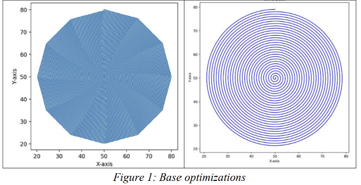
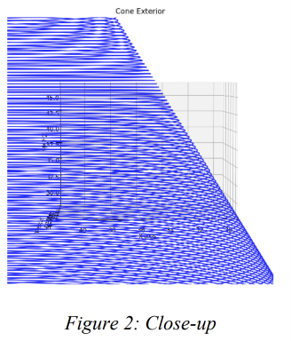
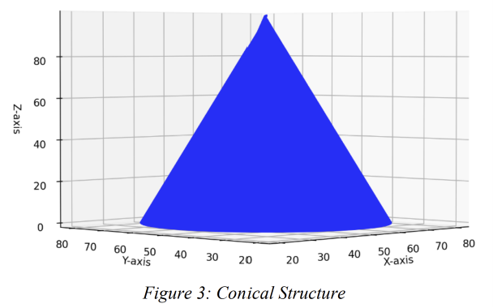
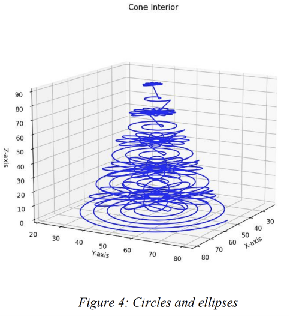
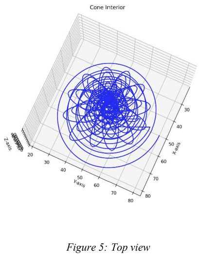

# Fabrication Method. Experimental Setup.

## This is section 3 of our research paper: [3D LASER FABRICATION OF CONICAL FIBER TIPS — Neagoie M., Zamfirescu M.](https://zenodo.org/records/8371857).

The fabrication of the microscopic cones was optimized thanks to a Python code we wrote that then generated the trajectory to be followed by the 3D Laser lithography equipment from Nanoscribe GmbH. To achieve this, we used Python libraries such as NumPy and Matplotlib, as well as mathematical principles and equations.

The strategy was to split the geometrical object into three parts: the base, the exterior surface of the structure and the interior volume, so that the different point density for each of them will lead both to an optimal fabrication time and good solidity.

For obtaining the base of the cone, our approach was to generate spiral hatching with an ever-decreasing radius, aiming for the smoothness of the created path. Several drawbacks have been overcome regarding the optimal laser scanning path, such as scanning strategy and even numerical errors. Thus, optimizations such as using the math.pi constant instead of an approximation or implementing a gradual increment between segments of the same spiral loop enabled us to go from the initial fragmented and deviated object as shown on the left side of the Figure 1 to the smooth base obtained on the right site of the same Figure.

The same technique was used for the exterior surface of the cone, except for the fact that, this time, each time we would increase with a set step in the Z direction, calculated so as to reach the designated height of the cone when the radius decreases towards zero at the cone tip. Also, we first tried a simultaneous implementation of both the exterior and the interior, but then opted for a separation due to the different aimed point density.

The biggest challenge was creating a structure for the cone interior volume that would be both solid and feasible for a reasonable fabrication time. The initial idea was to continue with the concentric circles, using the same algorithm as for the exterior surface, but ‘filling’ every level as the base. The issue with this was that by opting for a lower point density that would optimize the fabrication time, there would be gaps in the structure affecting both mechanical stability and the optical propagation properties of the structure. Thus, we came up with the idea of alternating two different hatching paths: the first one – a spiral hatching, and the second one – ellipses superimposed in the center of the corresponding circle. In this way, two consecutive Z levels have a different structure, therefore ensuring solidity. Figure 4 shows the applied scanning strategy as described above. The picture is represented intentionally with a much larger step in order for visualization to be easier. Also, we made sure to gradually decrease the ellipse radii accordingly to the corresponding decrease of the circle radius so as for the ellipses levels not to oversize the circles levels (Figure 5).

The Python code we developed is available in this repository.
